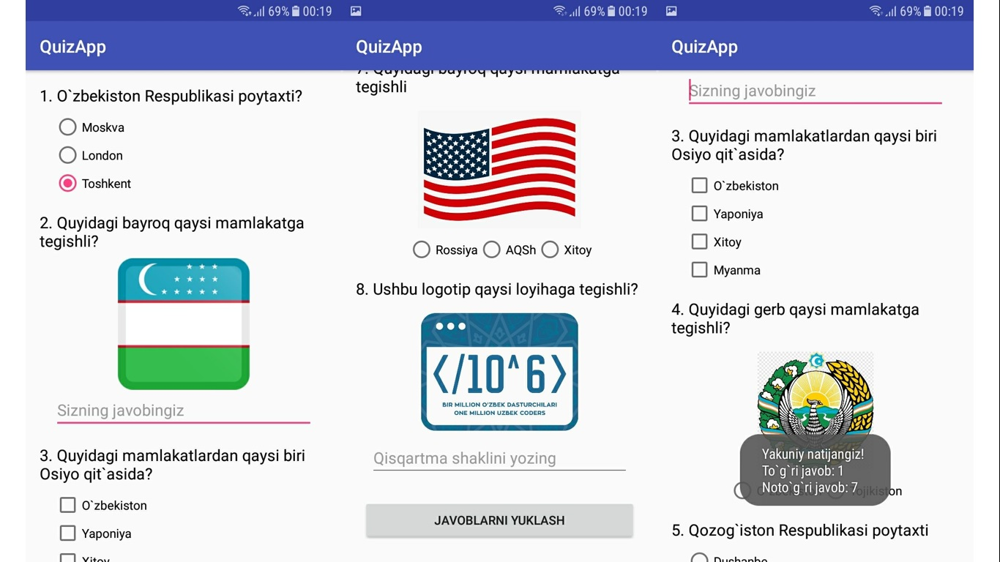

# QuizApp (Country and Capital, Creativ question)
One Million Uzbek Coders - Udacity (Andorid Basic third project)

# Requirement
The Quiz App project is a chance for you to combine and practice everything you learned in this section of the Nanodegree program. You will be making your own Android app - taking it from the idea stage to building out the full app. You can share your app with family and friends, as well as with other students in this course.

## Final Output - Screenshots
  

# Download
You can download the apk here [QuizApp](file/app-debug)

